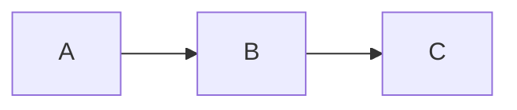
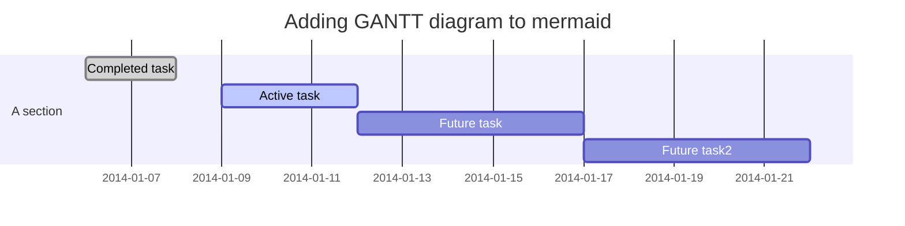
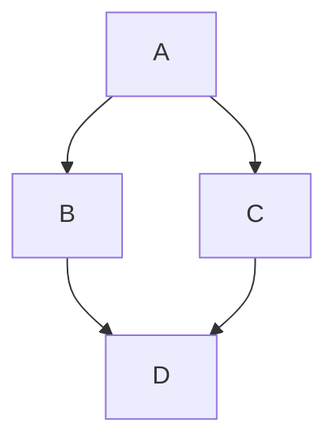

```flow
s=>start
e=>end
s->e
```

$$a_2 + {_1^2}\bigotimes{_3^4} \neq \sqrt{3+s^2}$$


```mermaid
graph LR;
	A-->B;
	B-->C;
```


```mermaid
gantt
dateFormat  YYYY-MM-DD
title Adding GANTT diagram to mermaid

section A section
Completed task            :done,    des1, 2014-01-06,2014-01-08
Active task               :active,  des2, 2014-01-09, 3d
Future task               :         des3, after des2, 5d
Future task2              :         des4, after des3, 5d
```


```mermaid
graph TD;
    A-->B;
    A-->C;
    B-->D;
    C-->D;
```

